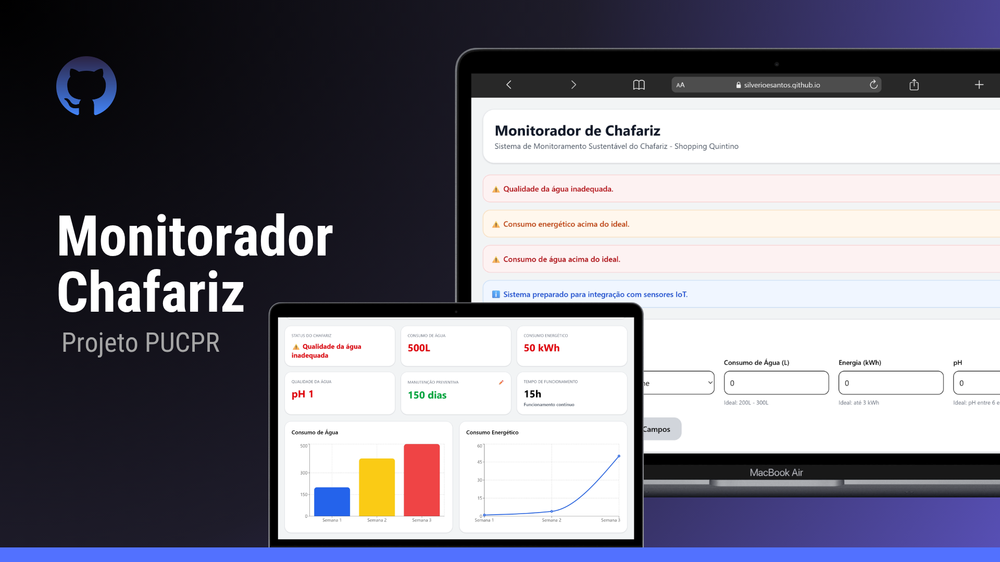

<h1 align="center"> Monitorador de Chafariz </h1>

  <a href="#-tecnologias">Tecnologias</a>&nbsp;&nbsp;&nbsp;|&nbsp;&nbsp;&nbsp;
  <a href="#-projeto">Projeto</a>

  

 

  

## 🚀 Tecnologias

Esse projeto foi desenvolvido com as seguintes tecnologias:

- HTML e CSS
- JavaScript
- Git e Github
- React + Node

## 💻 Projeto

O projeto “Monitorador de Chafariz” foi desenvolvido para proporcionar ao Shopping Quintino um controle mais eficiente sobre o consumo de energia, o uso de água e a qualidade da água do chafariz existente no local. Com o monitoramento contínuo dessas métricas, torna-se possível identificar oportunidades de melhoria, realizar ajustes necessários no funcionamento do sistema e promover uma gestão mais sustentável e eficiente do chafariz.

- [Acesse o projeto finalizado (online).](https://silverioesantos.github.io/monitorador-chafariz/)

## 📝 Licença

Esse projeto está sob a licença MIT.